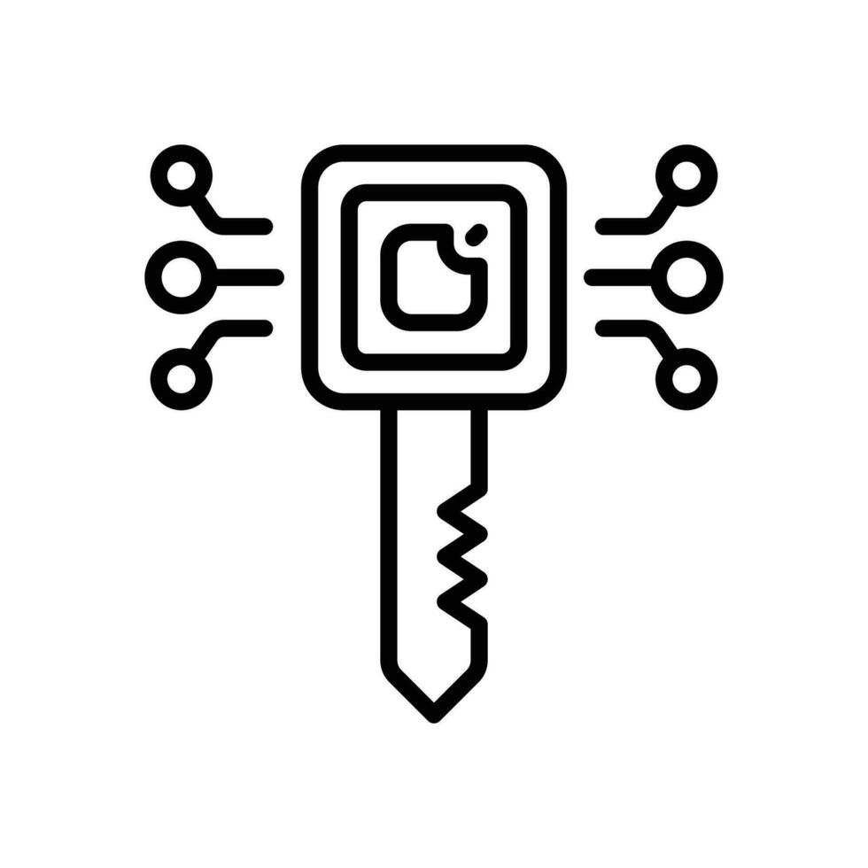

<h1 align="center" id="title">encryption and decryption system</h1>

<p align="center"></p>

<p id="description">This project demonstrates a basic encryption and decryption system using Python. The system allows users to securely encrypt messages and share them ensuring that only authorized users with the correct key can decrypt and read the messages.</p>

  
  
<h2>🧐 Features</h2>

Here're some of the project's best features:

*   Easy input for key and message.
*   Clear instructions for use.
*   Encrypts messages with a user-provided key.
*   Outputs encrypted messages for sharing.
*   Decrypts messages with the correct key.
*   Reveals original messages securely.
*   My own encryption algorithm.
*   Protects sensitive information.
*   Written in Python.
*   Uses built-in libraries.
*   Easy to enhance and integrate.
*   Modular code design.

<h2>🛠️ Installation Steps:</h2>

<p>1. clone the repo</p>

```
git clone https://github.com/dip-bash/encryption-and-decryption.git
```

<p>2. open encryption-and-decryption folder</p>

```
cd encryption-and-decryption
```

<p>3. run the program (win)</p>

```
python -u ./encryption_decryption.py
```

<p>4. run in linux</p>

```
python3 -u ./encryption_decryption.py
```

<h2>🍰 Guidelines:</h2>

* try to use pycharm instead of vs code
* never use special characters

  
  
<h2>💻 Built with</h2>

Technologies used in the project:

*   python
